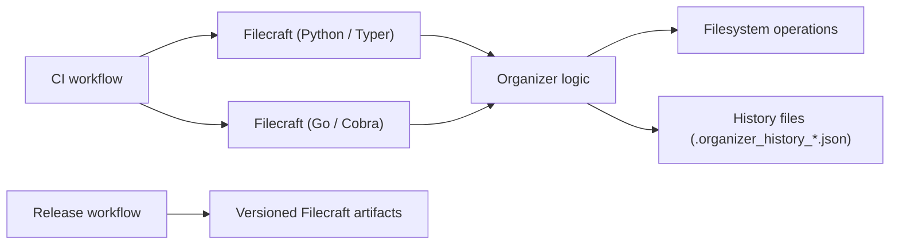

# Filecraft


Filecraft is a cross-language CLI suite for automating file management tasks such as sequential renaming, separation by rule, merging from multiple directories, and safe revert via history.

## Demo

<video src="https://raw.githubusercontent.com/murtazapatel89100/Filecraft/main/assets/demo-video.mp4" controls width="800"></video>


## Implementations

- [filecraft-python](filecraft-python): Python implementation (PyPI target).
- [filecraft-go](filecraft-go): Go implementation (GitHub Releases target).

Both implementations support:

- `rename`: sequential renaming with collision-safe file names
- `separate`: organize files by extension, date, extension+date, or file type
- `merge`: merge from multiple source directories with the same modes
- `revert`: restore moved files from saved history

Each implementation has its own README with install, usage examples, and command options.

## Distribution

- `filecraft-cli` (Python): published on PyPI.
- `Filecraft` (Go binary): published on GitHub Releases.
- Homebrew support is planned for `Filecraft`.

## Quick Start

### Python CLI

```bash
cd filecraft-python
poetry install --with dev --sync
poetry run filecraft --help
```

### Go CLI

```bash
cd filecraft-go
go run . --help
go build -o Filecraft .
./Filecraft --help
```

## Example Commands

Python:

```bash
poetry run filecraft rename --working-dir ./downloads --target-dir ./renamed --rename-with invoice
poetry run filecraft separate --mode extension --extension pdf --working-dir ./in --target-dir ./out --history
poetry run filecraft merge --mode file --working-dir ./downloads --working-dir ./desktop --target-dir ./merged
poetry run filecraft revert --directory ./out
```

Go:

```bash
./Filecraft rename --working-dir ./downloads --target-dir ./renamed --rename-with invoice
./Filecraft separate --mode extension --extension pdf --working-dir ./in --target-dir ./out --history
./Filecraft merge --mode file --working-dir ./downloads --working-dir ./desktop --target-dir ./merged
./Filecraft revert --directory ./out
```

## Architecture

See [docs/ARCHITECTURE.md](docs/ARCHITECTURE.md) for the detailed architecture diagram.



## Release Process

- See [docs/RELEASES.md](docs/RELEASES.md) for versioning, release commands, and workflow rules.

## Open Source Project Files

- Governance and community docs: `CONTRIBUTING.md`, `CODE_OF_CONDUCT.md`, `SECURITY.md`, `CODEOWNERS`
- Collaboration templates: `.github/PULL_REQUEST_TEMPLATE.md`, `.github/ISSUE_TEMPLATE/*`
- Maintenance and quality: `CHANGELOG.md`, `ROADMAP.md`, `Makefile`, `.github/dependabot.yml`, `.pre-commit-config.yaml`
- Full checklist status: [OPEN_SOURCE_CHECKLIST.md](OPEN_SOURCE_CHECKLIST.md)

## FAQ

### Why keep both Python and Go implementations?

To provide the same CLI behavior across two ecosystems while comparing developer and runtime tradeoffs.

### Where are releases published?

- `filecraft-cli` package: PyPI
- `Filecraft` binary: GitHub Releases
- Homebrew: planned for `Filecraft`

### Which version value is canonical for releases?

The release version must match across git tag (without `v`), `VERSION`, and `filecraft-python/pyproject.toml`.

### Where should command behavior changes be implemented?

In both implementations unless explicitly scoped otherwise.
