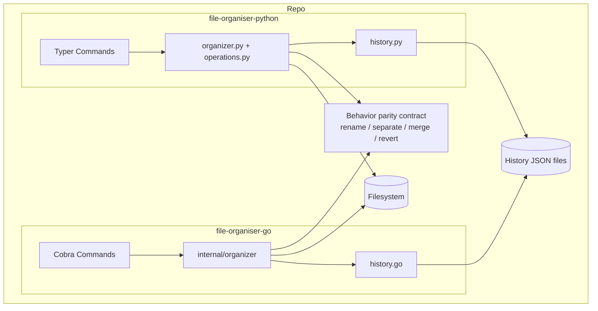

# Architecture

`organizer-cli` contains two CLI fronts with aligned behavior and separate language-specific internals.

## Diagram

## Key Points

- Python and Go CLIs should expose compatible flags and outcomes.
- History files are the safety mechanism for `revert`.
- CI validates lint/test/build for both implementations on Linux, macOS, and Windows.
- Release automation builds versioned binaries for both implementations and publishes GitHub Releases.
