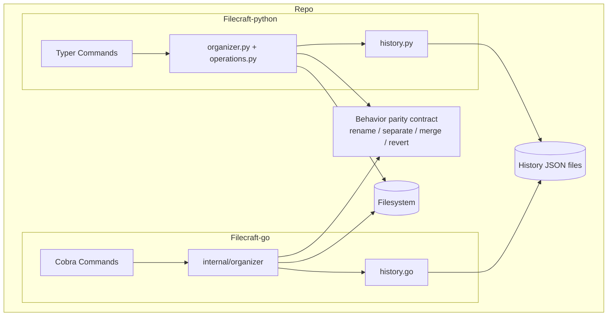

# Architecture

`Filecraft` contains two CLI fronts with aligned behavior and separate language-specific internals.

## Diagram

## Key Points

- Python and Go CLIs should expose compatible flags and outcomes.
- All separate/merge operations in both languages funnel through a single `_organize_files` (Python) / `organizeFiles` (Go) loop that owns the discover → filter → move → history pattern.
- History files are the safety mechanism for `revert`.
- CI validates lint/test/build for both implementations on Linux, macOS, and Windows.
- Git hooks (`.githooks/`) enforce lint on commit and tests on push. Run `make hooks` to activate.
- Release automation builds versioned binaries for both implementations and publishes GitHub Releases.
