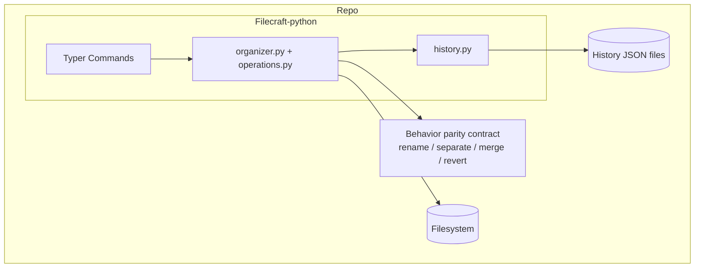

# Architecture

`Filecraft` is implemented in Python and provides a CLI for file organization.

## Diagram

```mermaid
flowchart TB
  subgraph Repo
    subgraph Python[Filecraft-python]
      PYCLI[Typer Commands]
      PYCORE[organizer.py + operations.py]
      PYHIST[history.py]
    end

    SHARED["Behavior parity contract<br/>rename / separate / merge / revert"]
    FS[(Filesystem)]
    HIST[(History JSON files)]
  end

  PYCLI --> PYCORE
  PYCORE --> PYHIST

  PYCORE --> SHARED

  PYCORE --> FS
  PYHIST --> HIST
```

## Key Points

- All separate/merge operations funnel through a single `_organize_files` loop that owns the discover → filter → move → history pattern.
- History files are the safety mechanism for `revert`.
- CI validates lint/test/build for the implementation on Linux, macOS, and Windows.
- Git hooks (`.githooks/`) enforce lint on commit and tests on push. Run `make hooks` to activate.
- Release automation builds versioned binaries and publishes GitHub Releases.
